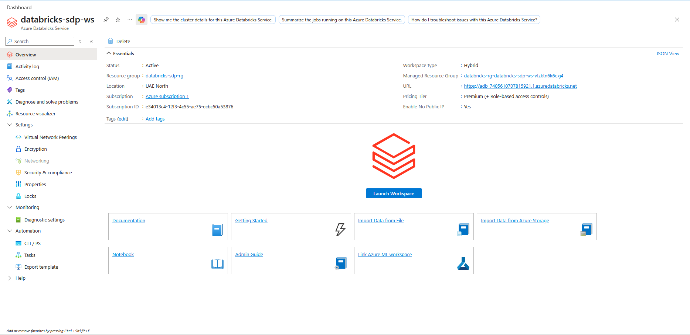
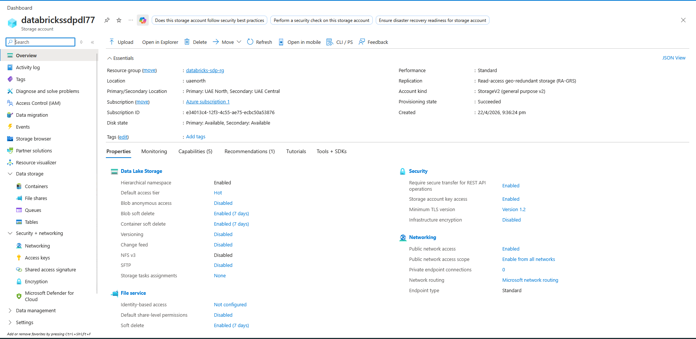
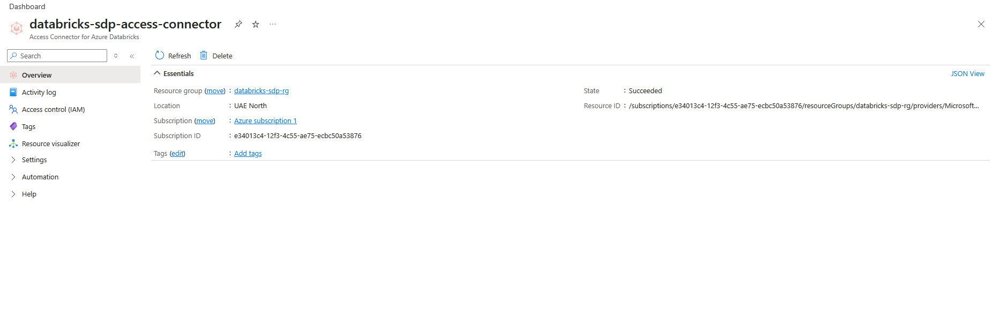
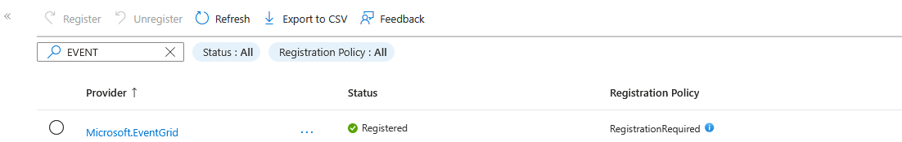
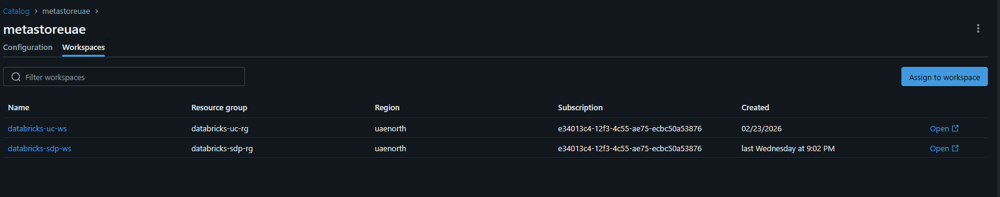

# Spark Declarative Pipelines — Catalog Creation Guide

A step-by-step setup for working with Databricks' **Spark Declarative Pipeline (SDP)** feature on Azure. This guide walks through provisioning the Azure resources, wiring up Unity Catalog, and preparing the workspace so you can start building SDP datasets.

---

## Prerequisites

- An active **Azure Subscription** with permission to create resources
- **Owner** or **User Access Administrator** role on the target resource group (for role assignments)
- A Databricks account with access to the Azure tenant

---

## Step 1 — Create a Databricks Workspace

Provision a new Databricks workspace in Microsoft Azure to work on the **Spark Declarative Pipeline** feature.

> _Screenshot:_
>
> 

---

## Step 2 — Create an Azure Data Lake Storage (ADLS) Account

Create a new **ADLS Gen2** storage account that will back your Unity Catalog and pipeline data.

> _Screenshot:_
>
> 

---

## Step 3 — Create an Access Connector for Azure Databricks

This connector establishes a managed identity-based connection between Azure and Databricks.

> _Screenshot:_
>
> 

---

## Step 4 — Enable `Microsoft.EventGrid` for the Azure Subscription

EventGrid is required for SDP file-arrival notifications.

1. Navigate to your **Azure Subscription**
2. Go to **Settings → Resource Providers**
3. Search for `Microsoft.EventGrid`
4. Click **Register**

> _Screenshot:_
>
> 

---

## Step 5 — Assign Roles to the ADLS Storage Account

Grant the **Access Connector** the following roles on your ADLS account:

| # | Role |
|---|------|
| 1 | EventGrid EventSubscription Contributor |
| 2 | Storage Account Contributor |
| 3 | Storage Blob Data Contributor |
| 4 | Storage Queue Data Contributor |

---

## Step 6 — Log in to the Databricks Account Console

Sign in using your Azure user principal credentials.

- **URL:** <https://accounts.azuredatabricks.net/>
- **User principal name formats:**
  - **Internal tenant user:** `<email>@<tenant>.onmicrosoft.com`
  - **Guest / external user** (invited via Azure B2B): `<email>#EXT#@<tenant>.onmicrosoft.com`

---

## Step 7 — Assign a Metastore to the Workspace

From the Databricks account console, attach a Unity Catalog **metastore** to your newly created workspace.

> _Screenshot:_
>
> 

---

## Step 8 — Configure Unity Catalog in Databricks

Open the **Catalog** tab in your Databricks workspace and complete the following:

### 8.1 Create a Storage Credential
Create a storage credential and assign the **Access Connector ID** of the connector created in Step 3.

### 8.2 Create an External Location
Create an external location pointing to the **catalog container** in your ADLS account.

### 8.3 Create a Catalog
Create a catalog and pass the storage location created in **Step 8.2**.

---

## Step 9 — Start Building SDP Datasets

Once the catalog is created, you're ready to start building **Spark Declarative Pipeline** datasets.

---

## Notes

- Keep all screenshots inside the [`screenshots/`](screenshots/) folder next to this file.
- Recommended naming convention: `<step>-<short-description>.png` (e.g., `04-register-eventgrid.png`).
- Replace each placeholder image link above as you capture and save the screenshots.
